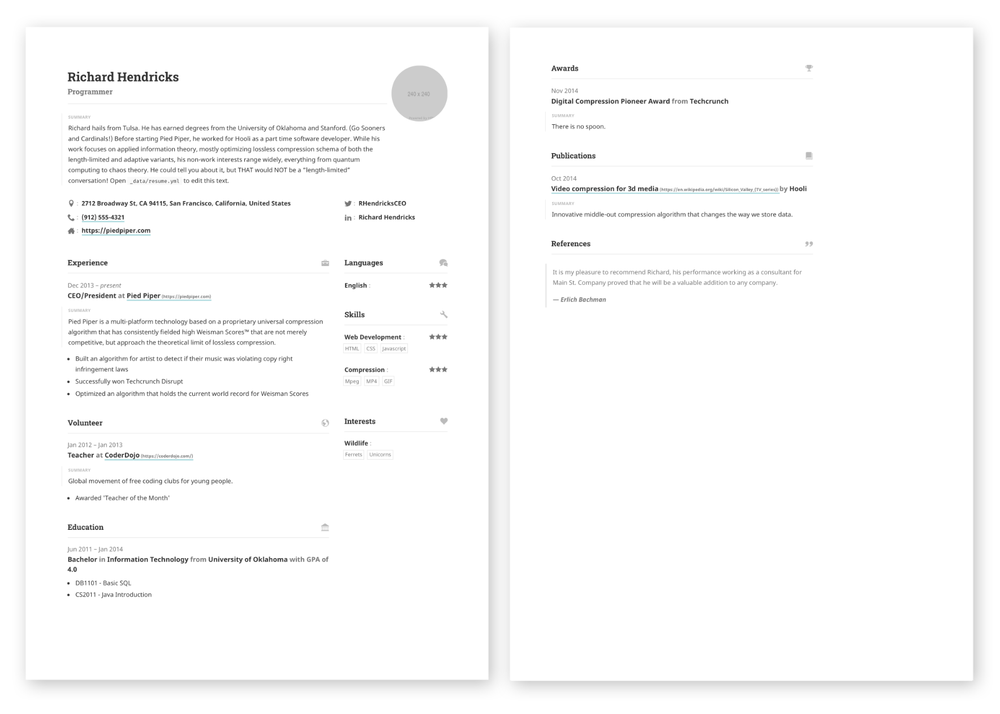
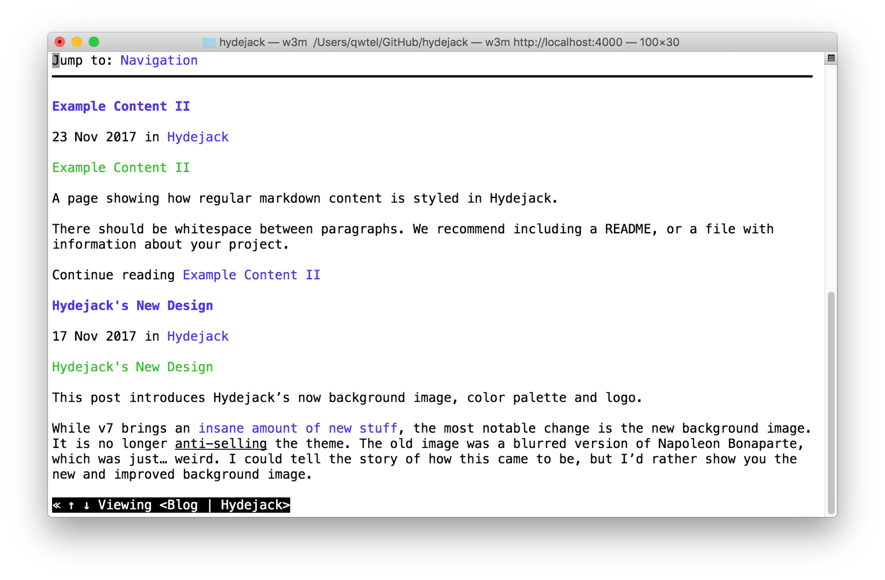

# About

<!--author-->

## Lee Sora

Java로 개발 공부 중입니다.
모과 집사에용🐈


<!-- ## Download




## A Printable Resume
pdf 파일 [PDF](assets/Resume.pdf).

[{:.lead width="884" height="632" loading="lazy"}][resume]{:.no-hover.no-mark}

가운데정렬
{:.figcaption}


## Just Markdown
Write all content with Markdown. __Hydejack__ gives you [additional CSS classes](docs/writing.md) to stylize your content, without losing compatibility with other Jekyll themes.


## Just Markup
`태그?`:

{:.tail width="1920" height="1260" loading="lazy"}

가운데정렬
{:.figcaption}


## 코드 쓰기
```html

<script type="module">
  document.querySelector("hy-push-state").addEventListener("hy-push-state-load", () => {
    const supportsCodeHighlights = false; // TBD!!
  });
</script>
```

'`' 3번 쓰고 언어 쓰면 해당 언어에 맞게 변경 <!-- 쓰면 주석 겸 파일 위치 표시 가능
{:.figcaption}


## 수학기호
달러 표시 두개로 가능

$$
\begin{aligned}
  \phi(x,y) &= \phi \left(\sum_{i=1}^n x_ie_i, \sum_{j=1}^n y_je_j \right) \\[2em]
            &= \sum_{i=1}^n \sum_{j=1}^n x_i y_j \phi(e_i, e_j)            \\[2em]
            &= (x_1, \ldots, x_n)
               \left(\begin{array}{ccc}
                 \phi(e_1, e_1)  & \cdots & \phi(e_1, e_n) \\
                 \vdots          & \ddots & \vdots         \\
                 \phi(e_n, e_1)  & \cdots & \phi(e_n, e_n)
               \end{array}\right)
               \left(\begin{array}{c}
                 y_1    \\
                 \vdots \\
                 y_n
               \end{array}\right)
\end{aligned}
$$

Hydejack uses KaTeX to efficiently render math.
{:.figcaption}


## Build an Audience
The PRO version has built-in support for customizable [Tinyletter] newsletter subscription boxes.

If you are using a different service like MailChimp, you can build a custom newsletter subscription box using [Custom Forms][forms].


## Features




## Comparison




## Get It Now

Use the the form below to purchase Hydejack PRO:

<div class="gumroad-product-embed" data-gumroad-product-id="nuOluY"><a href="https://gumroad.com/l/nuOluY">Loading…</a></div>


[blog]: /
[portfolio]: https://hydejack.com/examples/
[resume]: https://hydejack.com/resume/
[download]: https://hydejack.com/download/
[welcome]: https://hydejack.com/
[forms]: https://hydejack.com/forms-by-example/

[features]: #features
[news]: #build-an-audience
[syntax]: syntax-highlighting
[latex]: #beautiful-math
[dark]: https://hydejack.com/blog/hydejack/2018-09-01-introducing-dark-mode/
[search]: https://hydejack.com/#_search-input
[grid]: https://hydejack.com/blog/hydejack/

[lic]: LICENSE.md
[pro]: licenses/PRO.md
[docs]: docs/README.md
[ofln]: docs/advanced.md#enabling-offline-support
[math]: docs/writing.md#adding-math

[kit]: https://github.com/hydecorp/hydejack-starter-kit/releases
[src]: https://github.com/hydecorp/hydejack
[gem]: https://rubygems.org/gems/jekyll-theme-hydejack
[buy]: https://gum.co/nuOluY

[gpss]: https://developers.google.com/speed/pagespeed/insights/?url=https%3A%2F%2Fhydejack.com%2Fdocs%2F
[rouge]: http://rouge.jneen.net
[katex]: https://khan.github.io/KaTeX/
[mathjax]: https://www.mathjax.org/
[tinyletter]: https://tinyletter.com/
-->